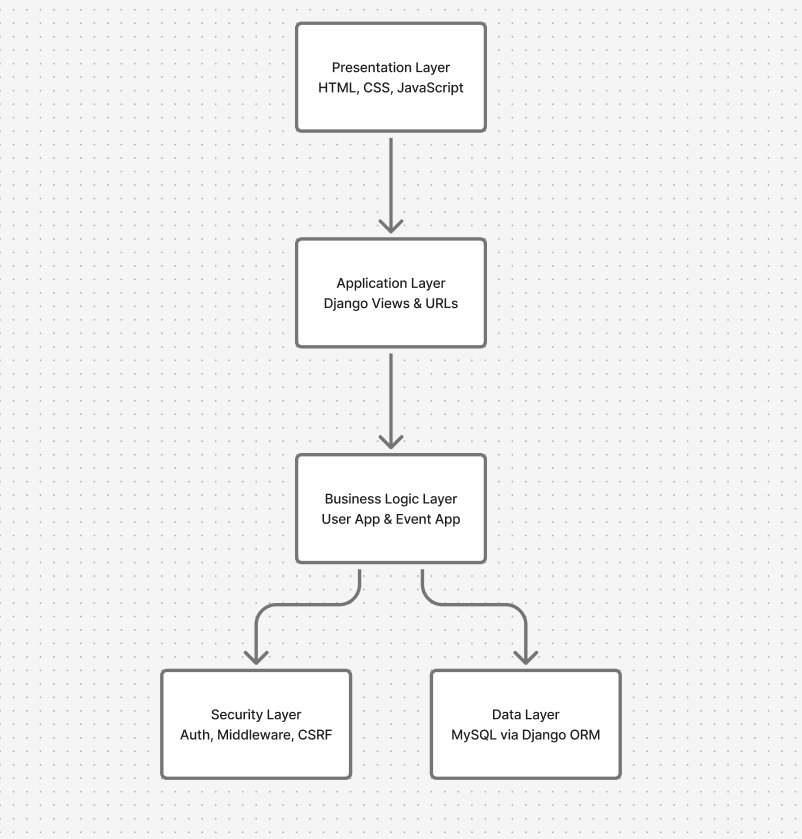
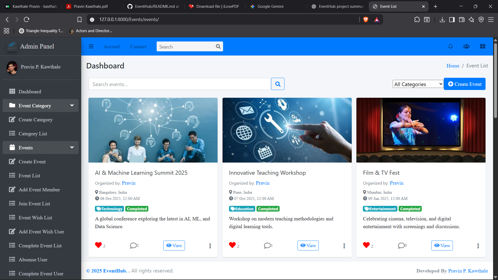
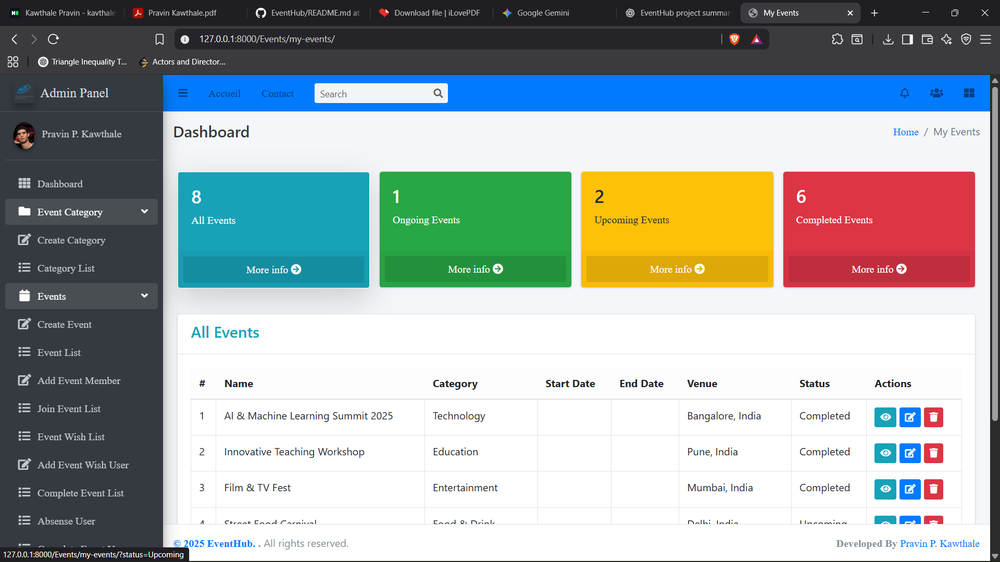

# 🚀 MyEventHub: Connect, Create, Conquer Events!

**MyEventHub** is a dynamic web application built with Django that revolutionizes how users explore, manage, and participate in events. Whether you're an organizer planning the next big gathering or an attendee looking for exciting activities, our platform offers a seamless, interactive experience.

---

## ✨ Features

| Feature | Description | Emoji |
|---------|-------------|-------|
| 🔐 **User Authentication** | Quick and secure registration and login via Django's built-in system. | 🔑 |
| 📝 **Event Management** | Create, edit, delete, and view events with ease. | ✍️ |
| 🔍 **Event Filters** | Find events based on category, date, and location. | 🗂️ |
| 🔍 **Advanced Event Search (FTS + BM25)** | Full-text search on title & description with ranked results. | 📝 |
| ⚡ **Real-time Search Sync** | SQLite triggers auto-update search index on insert/update/delete. | 🧑‍💻 |
| 🧠 **Search Relevance Ranking** | BM25 algorithm prioritizes meaningful matches. | 📝 |
| 💬 **Comments & Notifications** | Interact with other users and get notified about updates. | 🛎️ |
| 👤 **User Profiles** | Personalized profiles with full details and editable information. | 🧑‍💻 |

---
## 🔍 Intelligent Search System

MyEventHub implements **database-level full-text search**, not ORM-based filtering.

---

### ⚙️ How Search Works

- Uses **SQLite FTS5 virtual tables**
- Automatically creates an **inverted index**
- Search operates on:
  - `title`
  - `description`
- Ranking is handled using the **BM25 relevance algorithm**

---

### 🧠 Why This Matters

| Traditional ORM Search | MyEventHub Search |
|-----------------------|------------------|
| `LIKE '%text%'` | Inverted index lookup |
| Full table scan | Indexed token lookup |
| No ranking | BM25 relevance scoring |
| Slow at scale | Optimized and scalable |

---

### 🧪 Example SQL Used

```sql
SELECT e.*,
       bm25(Event_event_fts) AS rank
FROM Event_event e
JOIN Event_event_fts
     ON e.id = Event_event_fts.rowid
WHERE Event_event_fts MATCH ?
ORDER BY rank
LIMIT 20;
```
### 🔁 Automatic Sync Using Triggers

The FTS index remains synchronized using **SQLite triggers**:

- **INSERT** → index updated  
- **UPDATE** → index refreshed  
- **DELETE** → index cleaned  

No manual re-indexing is required.

## ⚙️ Architecture

<p align="center">
  
</p>

### 🌐 Presentation Layer (HTML, CSS, JavaScript)
- Responsible for **user interaction and UI rendering**
- Built using **Django templates**
- Displays events, comments, and chat messages
- Sends user actions (login, join event, send message) to the backend via **HTTP requests**
- Contains **no business logic** — only data rendering and form submission

---

### ⚙️ Application Layer (Django Views, URLs)
- Acts as the **request–response controller**
- Django views receive HTTP requests from the frontend
- URL routing maps requests to appropriate views
- Handles **form validation, request parsing, and response generation**
- Serves as the **bridge between UI and business logic**

---

### 🧠 Business Logic Layer (User App & Event App)
- Core layer where **application rules are enforced**
- Structured into two Django apps:
  - **User App**: authentication, authorization, user profiles
  - **Event App**: event creation, joining, comments, and chat access
- Enforces rules such as:
  - Only joined users can access chatrooms
  - Comments can be enabled or disabled per event
- Keeps **domain logic separate** from views and templates

---

### 🛡️ Security Layer (Authentication, Middleware, CSRF)
- Ensures **system safety and access control**
- Uses Django’s authentication system for session management
- CSRF protection for all form submissions
- Middleware handles request filtering, sessions, and permissions
- Prevents unauthorized access to events and chatrooms

---

### 🗄️ Data Layer (MySQL via Django ORM)
- Manages **data persistence and retrieval**
- MySQL stores users, events, comments, and chat messages
- Django ORM abstracts raw SQL queries
- Ensures **data consistency, integrity, and portability**

---
## 🖼 Screenshots

### Home Page


### My Event Page


---

## ⚙️ Installation

1. **Clone the repository**
    ```bash
    git clone https://github.com/your-username/MyEventHub.git
    cd MyEventHub
    ```

2. **Create a virtual environment**
    ```bash
    python -m venv env
    # Linux/Mac
    source env/bin/activate
    # Windows
    env\Scripts\activate
    ```

3. **Install dependencies**
    ```bash
    pip install -r requirements.txt
    ```

4. **Apply migrations**
    ```bash
    python manage.py makemigrations
    python manage.py migrate
    ```

5. **Create a superuser (admin)**
    ```bash
    python manage.py createsuperuser
    ```

6. **Run the development server**
    ```bash
    python manage.py runserver
    ```

7. **Open the app**  
Visit `http://127.0.0.1:8000/` in your browser.

---
## 💡 Usage

- **📝 Register/Login**: Users must register or log in to access event features.  
- **🎉 Create Events**: Logged-in users can create events with details such as title, description, date, and category.  
- **👀 View Events**: Browse ongoing, upcoming, or completed events.  
- **💬 Interact**: Comment on events and engage with other participants.  

---

## 🤝 Contributing

Contributions are welcome! Please follow these steps:

```bash
# 🍴 Fork the repository
# 🌿 Create a new branch
git checkout -b feature-name

# ✏️ Make your changes
# 💾 Commit your changes
git commit -m "Add some feature"

# 🚀 Push to the branch
git push origin feature-name

# 📩 Submit a pull request
