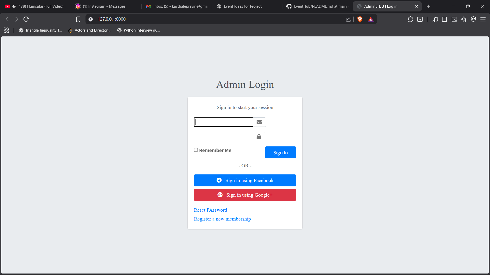
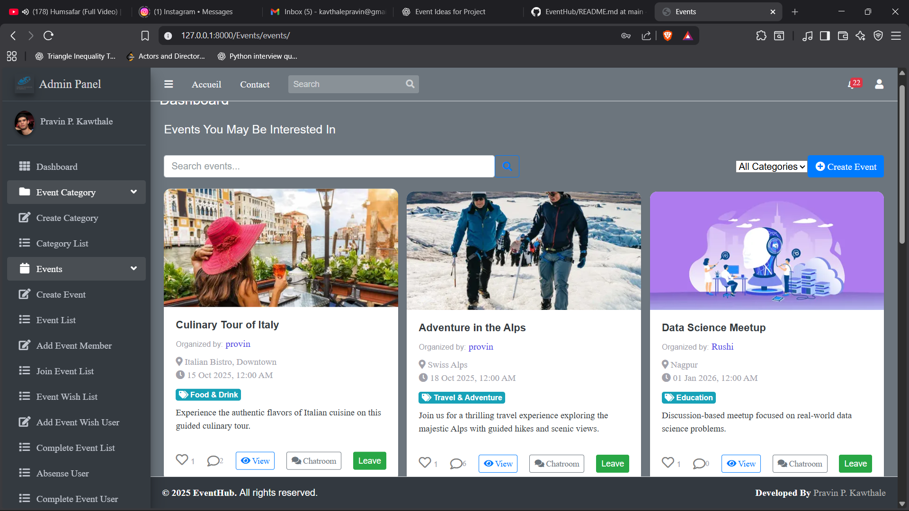
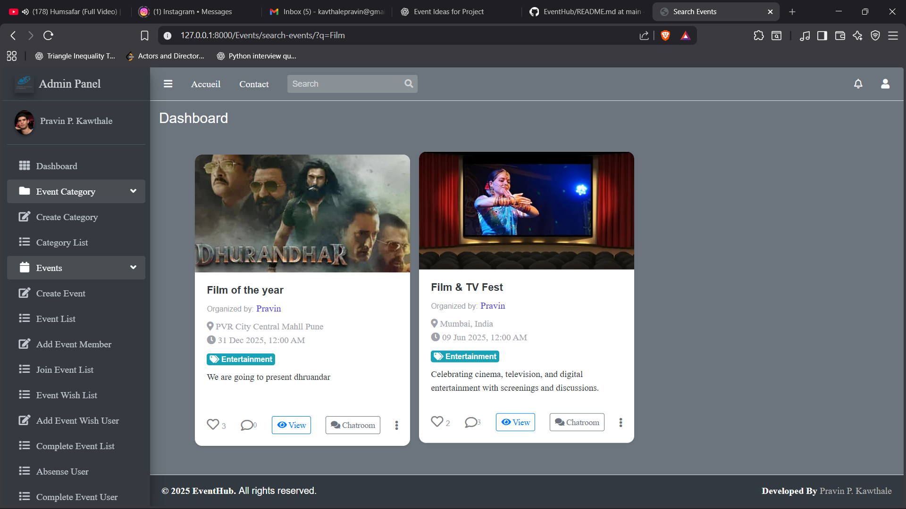
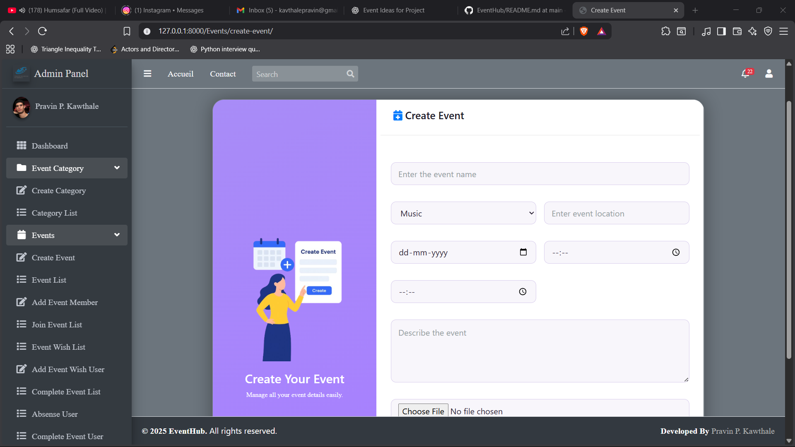
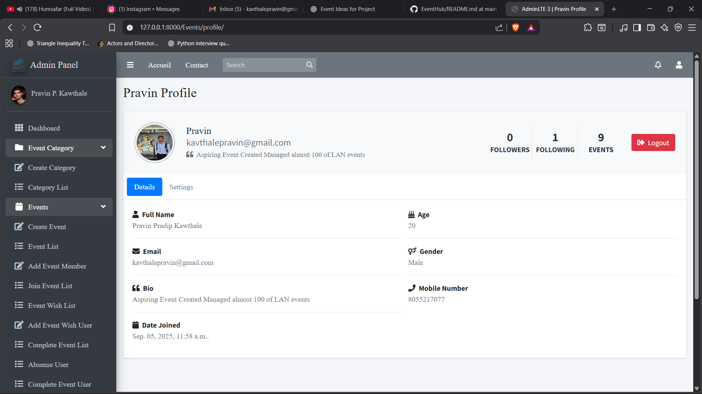

# 🚀 EventHub: Connect, Create, Conquer Events!

**MyEventHub** is a dynamic web application built with Django that revolutionizes how users explore, manage, and participate in events. Whether you're an organizer planning the next big gathering or an attendee looking for exciting activities, our platform offers a seamless, interactive experience.

---

## ✨ Features

| Feature | Description |
|--------|-------------|
| 🔐 User Authentication | Secure user registration and login using Django’s built-in authentication system |
| 📅 Event Management | Create, edit, delete, and view events with categories, images, and schedules |
| 🧠 Personalized Event Feed | Events are ranked uniquely per user based on interaction history (likes and participation) |
| ❤️ Event Likes | Users can like events, influencing personalized recommendations |
| 🤝 Event Participation | Joining events increases relevance in the personalized feed |
| 🔍 Full-Text Search (PostgreSQL FTS) | Database-level full-text search on event title and description using PostgreSQL |
| 📊 Relevance Ranking | Search results ranked using PostgreSQL’s `ts_rank_cd` scoring |
| ⚡ Search Index Optimization | High-performance GIN index on searchable text fields |
| 🛠️ Automatic Index Maintenance | Search index stays updated automatically via PostgreSQL indexing (no manual triggers) |
| 💬 Comments & Notifications | User interactions with real-time notification updates |
| 👤 User Profiles | Editable profiles with activity history (events created, liked, and joined) |


---
## 🧠 Personalized Event Recommendation System

MyEventHub implements a **rule-based personalization engine** that ensures each user sees events in a **unique order** based on their previous interactions.

---

### 🎯 Personalization Signals Used

- **Liked Events**  
  Increases preference for similar events in future recommendations.

- **Joined Events**  
  Strongly boosts the recommendation score for related events.

- **Category Affinity**  
  Events from categories the user frequently interacts with are ranked higher.

---

### Personalization Scoring Logic

Each event receives a **personalization score** per user using the formula: Score = (3 × Joined) + (2 × Liked)

Events are dynamically sorted in **descending order of personalization score**, ensuring that the most relevant events appear first for each user.

---

### Key Characteristics

- Different users see different event orders  
- Personalization is computed dynamically per request  
- Lightweight and fully explainable (no ML models)
- Designed to perform efficiently for small-to-medium scale datasets
  


## Information Retrieval (IR) Based Search System

Search is implemented using **PostgreSQL Full-Text Search (FTS)**, not Django ORM filtering.

---

### How Search Works

- PostgreSQL native **Full-Text Search**
- Text is converted to `tsvector` using `to_tsvector`
- Indexed fields:
  - `title`
  - `description`
- Query parsing via `plainto_tsquery`
- Ranking performed using **`ts_rank_cd` relevance scoring**
- Optimized with a **GIN index**

---

### Why This Matters

| Traditional ORM Search | EventHub Search |
|-----------------------|-----------------|
| `LIKE '%text%'` | Full-text token search |
| Full table scan | GIN-indexed lookup |
| No ranking | Relevance-based ranking |
| Slow at scale | Optimized and scalable |

---

### Example SQL Used

```sql
SELECT id,
       ts_rank_cd(
         to_tsvector('english', coalesce(title,'') || ' ' || coalesce(description,'')),
         plainto_tsquery('english', %s)
       ) AS rank
FROM "Event_event"
WHERE to_tsvector('english', coalesce(title,'') || ' ' || coalesce(description,'')) @@
      plainto_tsquery('english', %s)
ORDER BY rank DESC
LIMIT 20;

```
## Search vs Recommendation: Clear Separation of Concerns

| Feature | 🔍 Search System (FTS) | 🧠 Personalized Feed |
|--------|------------------------|----------------------|
| 🎯 Purpose | Explicit user query | Event discovery |
| 🛠️ Technique | PostgreSQL FTS + relevance ranking | Rule-based scoring |
| 🗄️ Database Use | Inverted text index (GIN) | Relational joins |
| 📊 Ordering | Relevance score | Personalization score |
| ⚡ Performance | Very fast | Acceptable for current scale |

---

## Index Consistency & Maintenance

- Search index is maintained automatically by **PostgreSQL**
- GIN index stays consistent on:
  - **INSERT**
  - **UPDATE**
  - **DELETE**
- No manual triggers or background re-indexing required

This reduces application complexity and improves reliability.

## ⚙️ Architecture

<p align="center">
  
</p>

### Presentation Layer (HTML, CSS, JavaScript)
- Responsible for **user interaction and UI rendering**
- Built using **Django templates**
- Displays events, comments, and chat messages
- Sends user actions (login, join event, send message) to the backend via **HTTP requests**
- Contains **no business logic** — only data rendering and form submission

---

### Application Layer (Django Views, URLs)
- Acts as the **request–response controller**
- Django views receive HTTP requests from the frontend
- URL routing maps requests to appropriate views
- Handles **form validation, request parsing, and response generation**
- Serves as the **bridge between UI and business logic**

---

### Business Logic Layer (User App & Event App)
- Personalized recommendation logic based on user interactions (likes and participation)
- Separate pipelines for search (IR-based) and browsing (personalization-based)
- Core layer where **application rules are enforced**
- Structured into two Django apps:
  - **User App**: authentication, authorization, user profiles
  - **Event App**: event creation, joining, comments, and chat access
- Enforces rules such as:
  - Only joined users can access chatrooms
  - Comments can be enabled or disabled per event
- Keeps **domain logic separate** from views and templates

---

### Security Layer (Authentication, Middleware, CSRF)
- Ensures **system safety and access control**
- Uses Django’s authentication system for session management
- CSRF protection for all form submissions
- Middleware handles request filtering, sessions, and permissions
- Prevents unauthorized access to events and chatrooms

---

### Data Layer (PostgreSQL via Django ORM)

- Manages **data persistence and retrieval**
- Uses **PostgreSQL** as the primary database
- Required for:
  - Full-Text Search (FTS)
  - GIN indexing
  - Relevance ranking using `ts_rank_cd`
- Stores:
  - Users
  - Events
  - Categories
  - Comments
  - Likes and participation records
  - Notifications and chat messages
- Hosted as a **managed cloud database on Render**
- Django ORM is used for:
  - Relational queries
  - Model validation
  - Database portability
- Raw SQL is selectively used for **FTS and ranking queries** where ORM is insufficient

This layer ensures **data integrity, performance optimization, and scalable search capabilities**.


---
---

## Deployment & Production Configuration

MyEventHub is **fully deployed and production-ready**, not just a local development project.

---

## Hosting & Infrastructure

- **Backend Hosting**: Render  
- **Database**: PostgreSQL (Render Managed Database)  
- **Media Storage**: Cloudinary  
- **Static Files**: Whitenoise  
- **Environment**: Production settings with `DEBUG = False`

This setup ensures scalability, reliability, and proper separation of concerns between application logic, media storage, and static assets.

---

## Database (Production)

- **PostgreSQL** used as the production database
- Hosted as a **managed Render PostgreSQL service**
- Supports **Full-Text Search, GIN indexing, and relevance ranking**


---

## Media & Static File Handling

| Asset Type | Technology Used | Purpose |
|-----------|-----------------|---------|
| Media Files (event images, profile images) | Cloudinary | Cloud-based storage and optimized delivery |
| Static Files (CSS, JS) | Whitenoise | Efficient static file serving in production |

- Media files are **not stored on the server**
- Static assets are compressed and cached via Whitenoise
- No dependency on external web servers like Nginx for static file handling

---

## ⚡ AJAX-Based Interactive Features

To improve user experience and responsiveness, MyEventHub uses **AJAX** for key interactions.

### 🔁 Instant Actions (No Page Reload)

- ❤️ Like / Unlike Event  
- 🤝 Join / Leave Event  
- 🔔 Notification updates  

These actions:
- Send asynchronous requests to Django views  
- Update the UI instantly  
- Reduce server load and unnecessary page reloads  

---

## QR-Based Event Authorization System

To ensure secure verification of event participants, MyEventHub includes a **QR code–based authorization mechanism**.

### How It Works

- When a user joins an event, a **unique QR code** is generated  
- The QR code is:
  - Linked to the user–event relationship
  - Non-transferable
- Event organizers can **scan the QR code at the venue**
- Only **verified joined users** are authorized for access

### Purpose & Benefits

- Prevents unauthorized entry  
- Eliminates fake or duplicate participation  
- Adds a real-world security layer to a digital system  
- Bridges online event management with offline validation  

---

## 🖼 Screenshots

### Login Page


### Personalized Dashboard


### Search Result Page


### Event Creation Page


### Profile Page


### Profile Update Page


### Category Create Page (Admin Level)


---

## ⚙️ Installation

1. **Clone the repository**
    ```bash
    git clone https://github.com/your-username/MyEventHub.git
    cd MyEventHub
    ```

2. **Create a virtual environment**
    ```bash
    python -m venv env
    # Linux/Mac
    source env/bin/activate
    # Windows
    env\Scripts\activate
    ```

3. **Install dependencies**
    ```bash
    pip install -r requirements.txt
    ```

4. **Apply migrations**
    ```bash
    python manage.py makemigrations
    python manage.py migrate
    ```

5. **Create a superuser (admin)**
    ```bash
    python manage.py createsuperuser
    ```

6. **Run the development server**
    ```bash
    python manage.py runserver
    ```

7. **Open the app**  
Visit `http://127.0.0.1:8000/` in your browser.

---
## Usage

- **📝 Register/Login**: Users must register or log in to access event features.  
- **🎉 Create Events**: Logged-in users can create events with details such as title, description, date, and category.  
- **👀 View Events**: Browse ongoing, upcoming, or completed events.  
- **💬 Interact**: Comment on events and engage with other participants.  

---

## 🤝 Contributing

Contributions are welcome! Please follow these steps:

```bash
# 🍴 Fork the repository
# 🌿 Create a new branch
git checkout -b feature-name

# ✏️ Make your changes
# 💾 Commit your changes
git commit -m "Add some feature"

# 🚀 Push to the branch
git push origin feature-name

# 📩 Submit a pull request
